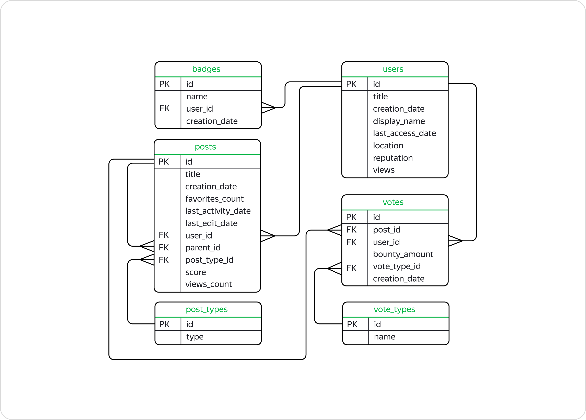

## Description :key:
We work with the Stackoverflow database which contains information on posts data for 2008, but the tables also provide information on the later evaluations that these posts received. There are 6 tables that are linked using unique IDs (down below).
The project is divided into two parts: in the first part, requests are made directly to the database. In the second section, we work with the database using SQLAlchemy library (in Jupyter Notebook).

## Tasks :ballot_box_with_check:
The main objective of the project is to analyze the database using SQL queries.

## Scope of activities :bulb:
Internet services, Data Analyst, Product Analyst, Reporting Analyst.

## Used Languages :mortar_board:
SQL (PostgreSQL).

## Tags :label:
SQL, PostgreSQL, Internet services, Social networks, SQL, SQLAlchemy, Data uploading, Data processing, Visualization, Product metrics, Window functions, Cohort analysis.

## Project Status :black_square_button:
_Completed_ 
____________________________________________________

# General information

**According to the documentation:**  

*badges*   
Contains information on badges that are awarded for different achievements. For example, a user who has successfully answered many questions about PostgreSQL may obtain a postgresql badge.

- primary key `id` — ID or unique purchase number;
- `name` - badge name;
- foreign key `user_id` — refers to the 'users' table - user ID to whom the badge was assigned;
- `creation_date` — date of assignment;

*post_types*    
Contains information on post types. There may be 2: question\answer.

- primary key `id` — unique post ID;
- `type` — post type;

*posts*      
Contains information on posts.      

- primary key `id` — unique post ID;
- foreign key `user_id` — refers to the 'users' table — user ID who created the post;
- `title` — post title;
- `creation_date` — post creation_date;
- `favorites_count` — the number of times the post was added to the "Bookmarks";
- `last_activity_date` — date of the last action in the post, eg comment.;     
- `last_edit_date` — last edit date;
- `parent_id` — if a post is written in reply to a different post, this field will include the post ID with the question; 
- foreign key `post_type_id` — refers to the 'post_types' table — post type identifier;
- `score` — number of points scored;
- `views_count` - number of views;          

*users*       
Contains information on users.

- primary key `id` — unique user identifier;
- `creation_date` — registration date;
- `display_name` — user name;
- `last_access_date` — last access date;
- `location` — users country;
- `reputation` - reputation points that users obtain for good questions and helpful answers.;
- `views` — number of profile views;
 

*vote_types*        

Contains information on type of vote. There are several types of votes:
*UpMod* - mark for posts with questions or answers that users have considered appropriate and useful.        
*DownMod* - mark for posts that users have considered to be the least useful.      
*Offensive* - such a mark can be placed if the user answered the question in a rude and offensive manner, for example, by pointing out the inexperience of the author of the post.
*Spam* - this label is placed in the case if the post looks like an ad.

- primary key `id` — unique type identifier;
- `name` — label name;

*votes*       
Contains information on votes.

- primary key `id` — unique vote identifier;
- foreign key `post_id` — refers to the 'posts' table — unique post number;
- foreign key `user_id` — refers to the 'users' table — unique user number;
- foreign key `vote_type_id` — refers to the 'vote_types' table — unique vote type number;
- `bounty_amount` — the amount of pay awarded to draw attention to the post;
- `creation_date` — vote creation date;       