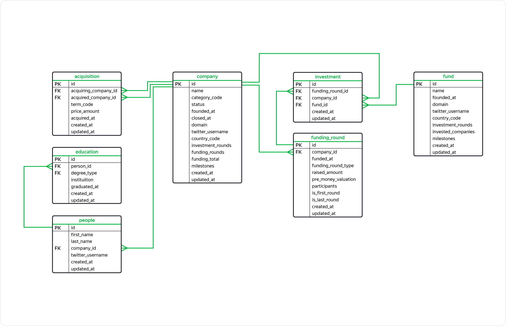

## Description :key:
In this project we work with the database which contains information about the startup ecosystem: organizations, individuals, company news, funding rounds, acquisitions, and IPOs. There are 7 tables that can be joined using unique IDs (schema is below). 

## Tasks :ballot_box_with_check:
The main objective of the project is to analyze the market using SQL queries.

## Scope of activities :bulb:
Startups, Investments, Data Analyst, Financial Analyst, Reporting Analyst.

## Used Languages :mortar_board:
SQL (PostgreSQL).

## Tags :label:
SQL, PostgreSQL, Investments, Market, Funds, Startups, Funding rounds.

## Project Status :black_square_button:
_Completed_ 
____________________________________________________

# General information

**According to the documentation:**  

*acquisition*   
Contains information on purchases from certain companies by others.      

- primary key `id` — ID or unique purchase number;
- foreign key `acquiring_company_id` — refers to the 'company' table - ID of the purchasing company, that is, the one that buys another company;
- foreign key `acquired_company_id` — refers to the 'company' table - ID of the company to be purchased;
- `term_code` — payment method:
    - cash;
    - stock;
    - cash_and_stock;
- `price_amount` — amount of purchase in dollars;
- `acquired_at` — purchase date;
- `created_at` — the date and time the record was created in the table;
- `updated_at` — the date and time the record was updated in the table;

*company*    
Contains information on startups.

- primary key `id` — ID or unique company number;
- `name` — name of the company;
- `category_code` — type of activity of the company, such as:
    - news — специализируется на работе с новостями;
    - social — специализируется на социальной работе.
- `status` — status of the company:
    - acquired — приобретена;
    - operating — действует;
    - ipo — вышла на IPO;
    - closed — перестала существовать.
- `founded_at` — date of foundation;
- `closed_at` — closing date (if the company no longer exists);
- `domain` — company website domain;
- `twitter_username` — the name of the company profile on Twitter;
- `country_code` — country code;
- `investment_rounds` — the number of rounds in which the company participated as an investor;
- `funding_rounds` — the number of rounds in which the company attracted investment;
- `funding_total` — the amount of investments attracted (dollars);
- `milestones` — number of major milestones in the company's history;
- `created_at` — the date and time the record was created in the table;
- `updated_at` — the date and time the record was updated in the table;

*education*
Contains information on the level of education of company employees.      

- primary key `id` — ID or unique number of a record;
- foreign key `person_id` — refers to the 'people' table — person identifier;
- `degree_type` — academic degree, for example:
    - BA — Bachelor of Arts;
    - MS — Master of Science;
- `instituition` — education institution;
- `graduated_at` — graduation date;
- `created_at` — the date and time the record was created in the table;
- `updated_at` — the date and time the record was updated in the table;     

*fund*
Contains information on the venture funds.

- primary key `id` — unique fund number;
- `name` — fund name;
- `founded_at` — foundation date;
- `domain` — site domain;
- `twitter_username` — the name of the fund profile on Twitter;
- `country_code`
- `investment_rounds` — number of investment rounds the fund participated;
- `invested_companies` — number of companies the fund invested;
- `milestones` — number of major milestones in the fund's history;
- `created_at` — the date and time the record was created in the table;
- `updated_at` — the date and time the record was updated in the table;   

*funding_round*        
Contains information on funding rounds.            

- primary key `id` — unique round number;
- foreign key `company_id` — refers to the 'company' table  — unique company ID that participated in the round;
- `funded_at` — round date;
- `funding_round_type` — round type, for example:
    - venture — venture round;
    - angel — angel round;
    - series_a — round A.
- `raised_amount` — the amount of investment the company has attracted in this round (dollars);
- `pre_money_valuation` — preliminary pre-investment valuation of the company in dollars;
- `participants` — number of participants;
- `is_first_round` — whether this round is the first for the company;
- `is_last_round` — whether this round is the last for the company;
- `created_at` — the date and time the record was created in the table;
- `updated_at` — the date and time the record was updated in the table;       

*investment*       
Contains information on venture fund investments in startups.      

- primary key `id` — unique investment identifier;
- foreign key `funding_round_id` — refers to the 'funding_round' table — unique round number;
- foreign key `company_id` — refers to the 'company' table — unique number of the startup for investment;
- foreign key `fund_id` — refers to the 'fund' table — unique number of the fund investing in the startup;
- `created_at` — the date and time the record was created in the table;
- `updated_at` — the date and time the record was updated in the table;       

*people*      
Contains information on employees of startups.          

- primary key `id` — unique identifier;
- `first_name`
- `last_name`
- foreign key `company_id` — refers to the 'company' table — unique startup identifier;
- `twitter_username` — employee profile on Twitter;
- `created_at` — the date and time the record was created in the table;
- `updated_at` — the date and time the record was updated in the table;
