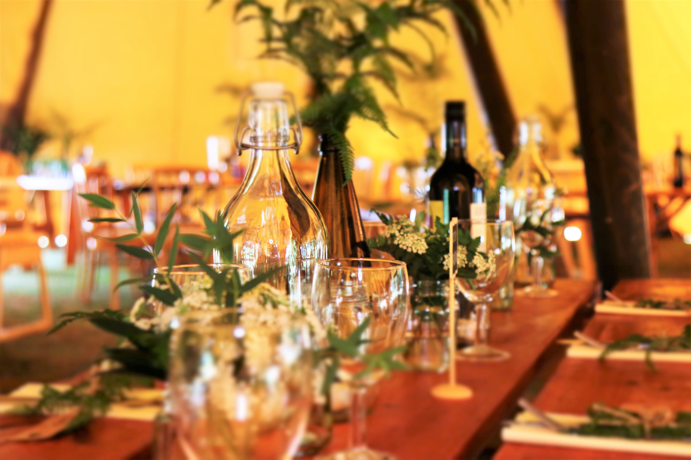

## Description :key:
In this project we analyze the catering market in Moscow based on open source data and investigate the question - will be successful and popular for a long time cafe, where clients will be served by robot waiters. Based on the analysis, we make a presentation to investors with recommendations.

## Tasks :ballot_box_with_check:
The main objectives of the project are to identify modern trends in the food & beverage market and to develop geographic guidelines and templates for the new restaurant chain. 

## Scope of activities :bulb:
Startups, Catering, Investments, Presentation, Tech-company, Marketing analyst, Data Analyst. 

## Used Libraries :mortar_board:
Pandas, Seaborn, Matplotlib, Pymystem3, Collections, NumPy.

## Tags :label:
Python, Pandas, NumPy, Matplotlib, Seaborn, Exploratory Data Analysis (EDA), Visualizations, Preprocessing, Data artifacts, Pie chart, Boxplot, Google Slides.

## Project Status :black_square_button:
_Completed_ 
