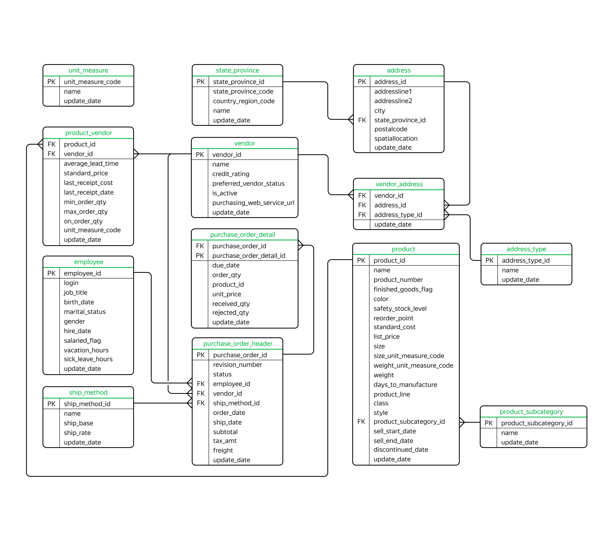

## Description :key:
The Adventure Works database is a Microsoft product sample for an online transaction processing (OLTP) database. It supports a fictitious, multinational manufacturing company called Adventure Works Cycles. 

ERD:

## Tasks :ballot_box_with_check:
The main goal of the project is to analyze the database using SQL queries (PostgreSQL).

## Scope of activities :bulb:
Finance, Startups, Tech-company, Business services [b2b], Financial analyst, Marketing.

## Used Languages :mortar_board:
SQL (PostgreSQL).

## Tags :label:
Exploratory Data Analysis, SQL, PostgeSQL, DML, Window Functions, Window Frames, Filtering.

## Project Status :black_square_button:
_Completed_ 
