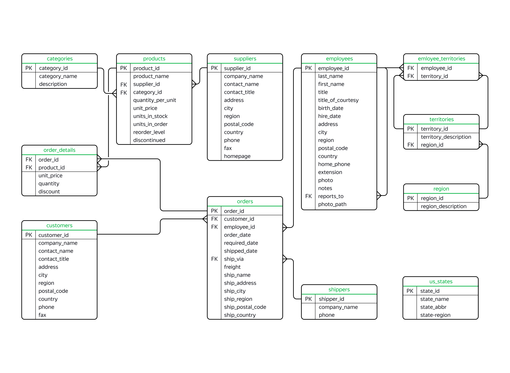

## Description :key:
The Northwind database is a sample database that was originally created by Microsoft and used as the basis for their tutorials in a variety of database products for decades. The database contains the sales data for a fictitious company called "Northwind Traders", which imports and exports specialty foods from around the world.

ERD:

## Tasks :ballot_box_with_check:
The main goal of the project is to analyze the database using SQL queries (PostgreSQL).

## Scope of activities :bulb:
Finance, Startups, Tech-company, Business services [b2b], Financial analyst, Marketing.

## Used Languages :mortar_board:
SQL (PostgreSQL).

## Tags :label:
Exploratory Data Analysis, SQL, PostgeSQL, DML, Window Functions, Window Frames, Filtering.

## Project Status :black_square_button:
_Completed_ 
